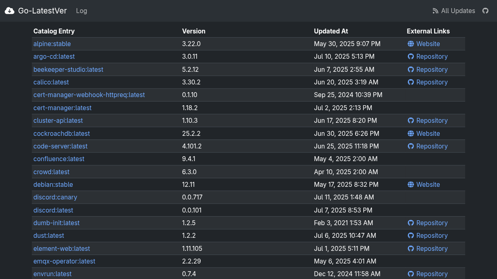
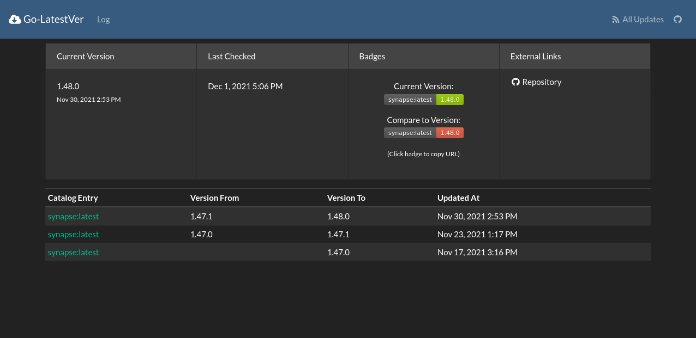
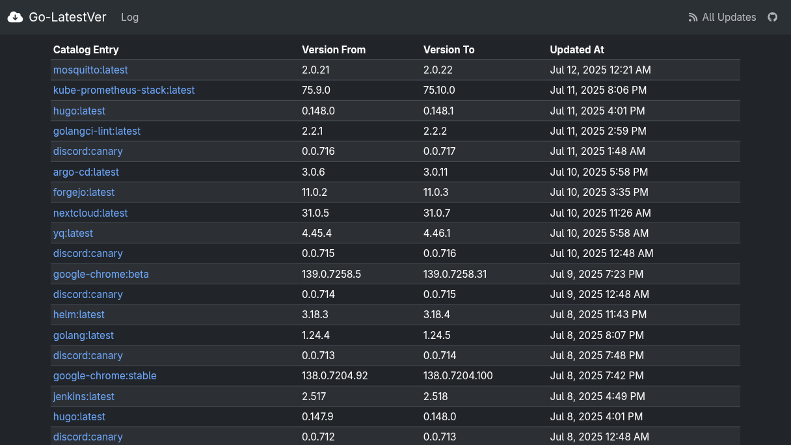

[](https://goreportcard.com/report/github.com/Luzifer/go-latestver)


# Luzifer / Go-LatestVer

Go-LatestVer is a replacement for the outdated and no longer maintained [latestver](https://github.com/binarybabel/latestver) following the same idea: Monitor a bunch of different sources of software in a single location using different kinds of fetchers, providing an API to have these information available in a single place and provide an UI to the user to look up versions easily.

## Usage

```console
Usage of go-latestver:
      --badge-gen-instance string     Where to find the badge-gen instance to use badges from (default "https://badges.fyi/")
      --base-url string               Base-URL the application is reachable at (default "https://example.com/")
      --check-distribution duration   Checks are executed at static times every [value] (default 1h0m0s)
  -c, --config string                 Configuration file with catalog entries (default "config.yaml")
      --listen string                 Port/IP to listen on (default ":3000")
      --log-level string              Log level (debug, info, warn, error, fatal) (default "info")
      --storage string                Storage adapter to use (mysql, sqlite) (default "sqlite")
      --storage-dsn string            DSN to connect to the database (default "file::memory:?cache=shared")
      --version                       Prints current version and exits
```

To use the `github_release` fetcher without hitting the API limits quite fast provide `GITHUB_CLIENT_ID` and `GITHUB_CLIENT_SECRET` of an [OAuth App](https://github.com/settings/developers) in environment variables.

## Screenshots

### Catalog Index


### Catalog Entry


### Global Changelog

